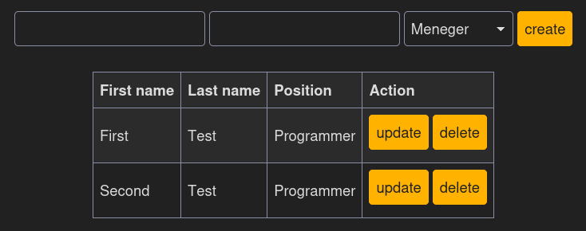
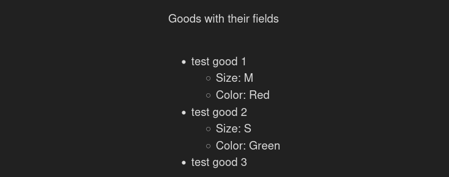

# Test task Project





### Two test tasks from the document.

## Installation

1. **Clone the repository:**

   ```sh
   git clone https://github.com/myworksbk/test_task_new test.io
   cd test.io
   ```

2. **Import the db data:**
   - Import the dump file `database/goods_fields.sql`
   - Import the dump file `database/users_positions.sql`

3. **Run composer install:**

   ```sh
   composer install
   ```

4. **Configure the app:**

   Edit the config files
   - `configs/database.php`
   - `configs/app.php`

5. **Sep up the server:**

   ```sh
   php -S localhost:8088 -t public/
   ```

## Usage

1. **Open the url http://localhost:8088**

   There are two links for each task in accordance:
   - http://localhost:8088/first-task
   - http://localhost:8088/second-task

## Issues

### If a error accour please see the logs/ filder in the root of app!